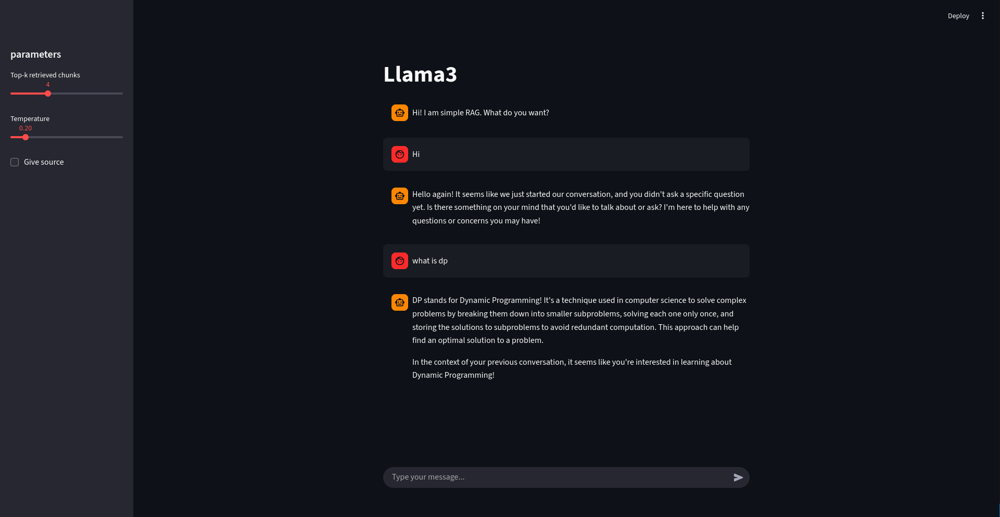

# simple-rag
Simple retrival-augmented generation. We use llama3 as main LLM to talk with AI. For embeddings we use bge-m3.

## Functionalities
talk with AI about the specific documents.



we can have custom paremeters for top-k retrived chunks, temperature of the AI and checkbox for give source.

## Setup with Docker
**Disclaimer:** this process will take about 6 GB of your space. Recommend to have good pc.

1. Have Docker
2. Clone this repo

    ```
    git clone git@github.com:Kezak1/simple-rag.git
    cd simple-rag
    ```
3. Put inside directory `data/` your pdfs (maybe dont put to much because it is pretty heavy to make the vectorstore and it take some time)
4. Build docker
    ```
    docker compose build
    ```
5. Run ollama and appropriate models
    ```
    docker compose up -d ollama
    docker compose exec ollama ollama pull bge-m3
    docker compose exec ollama ollama pull llama3
    ```
6. Process your pdfs, by running process_data.py
    ```
    docker compose run --rm app python src/process_data.py
    ```
7. Run the app
    ```
    docker compose up
    ```
